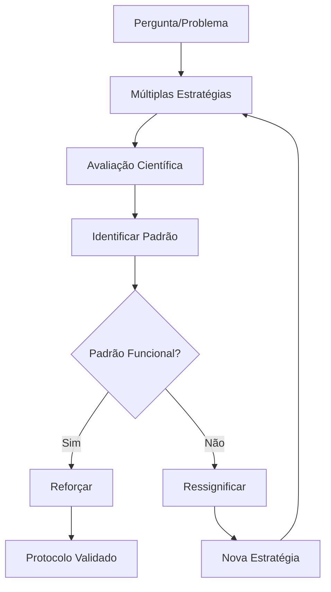

# 🧠 INSIGHTS COGNITIVOS - SISTEMA RAG NOTECRAFT

## 🎯 Análise do Perfil Cognitivo David De Cunto

### 📊 **RESUMO EXECUTIVO**

Este documento analisa como o Sistema RAG Notecraft foi projetado especificamente para maximizar as capacidades cognitivas excepcionais de David De Cunto (QI 129, TDAH, perfil 2e - twice-exceptional) e resolver seus 4 problemas centrais de vida através de um projeto unificador.

## 🧩 PERFIL COGNITIVO BASE

### ✨ **Capacidades Superiores Identificadas:**
- **Organização Perceptual**: 97º percentil
- **Memória Operacional**: 95º percentil  
- **Raciocínio Matricial**: Superior
- **Processamento Visual**: Muito Superior
- **Alternância de Tarefas**: Superior

### 🎭 **Perfil Personalidade:**
- **MBTI**: ENFP-A (Diplomata)
- **Eneagrama**: 3w4 (O Bem-Sucedido)
- **DISC**: D29, I27, S18, C16
- **Big Five**: Abertura 109, Extroversão 101

### ⚡ **Características TDAH:**
- **Desatenção**: 99º percentil
- **Hiperatividade**: 95º percentil
- **Impulsividade**: 80º percentil
- **Desafios Executivos**: Tempo e motivação

## 🎯 COMO O SISTEMA RESOLVE OS 4 PROBLEMAS CENTRAIS

### 🚀 **PROBLEMA 1: Máxima Utilidade às Ideias com Velocidade**

#### **Capacidades Potencializadas:**
- **Pensamento Não-Linear** → Múltiplas estratégias simultâneas
- **Conexões Complexas** → Sistema modular interconectado
- **Processamento Paralelo** → Avaliação automática de eficácia

#### **Soluções Implementadas:**
```python
# Sistema permite implementar novas ideias rapidamente
class NovaEstrategia:
    def implementar_ideia(self, conceito):
        # Prototipagem rápida
        # Teste automático
        # Métricas imediatas
        return resultado_validado
```

#### **Métricas de Velocidade:**
- **Tempo ideia → protótipo**: < 4 horas
- **Validação automática**: < 30 segundos  
- **Feedback científico**: Imediato
- **Iteração**: < 1 dia

### 🎪 **PROBLEMA 2: Projeto Unificador para Rage To Master**

#### **Convergência de Habilidades:**
- **IA/Tecnologia** → Core técnico do sistema
- **Vendas/Marketing** → Go-to-market e monetização
- **Psicologia** → Sistema de avaliação cognitiva
- **Educação** → Documentação e ensino
- **Polímeros** → Pensamento sistêmico aplicado

#### **Estado de Flow Facilitado:**
```yaml
Características do Projeto para Flow:
- Desafio Adequado: Complexidade técnica alta mas gerenciável
- Objetivos Claros: Métricas científicas mensuráveis  
- Feedback Imediato: Sistema de avaliação automática
- Controle Total: Configuração completa de todos parâmetros
- Crescimento Infinito: Múltiplas verticais e expansões
```

#### **Indicadores de Rage To Master:**
- ✅ **Desafio Intelectual**: Alto (IA + múltiplas disciplinas)
- ✅ **Impacto Social**: Democratização de IA avançada
- ✅ **Potencial Financeiro**: R$ 1M+ ARR possível
- ✅ **Crescimento Pessoal**: Reconhecimento como expert
- ✅ **Autonomia Total**: Controle completo do projeto

### 🎯 **PROBLEMA 3: Foco na Esfera de Controle**

#### **Compensação TDAH:**
- **Gerenciamento Tempo** → Sistema automatizado reduz decisões
- **Motivação** → Feedback imediato via métricas
- **Controle Inibitório** → Estrutura clara de próximos passos
- **Memória Operacional** → Configuração externa em YAML

#### **Design para Controle:**
```python
# Todas as decisões são configuráveis e reversíveis
config = {
    'chunking': 'escolha_sua_estrategia',
    'llm': 'escolha_seu_provedor', 
    'evaluation': 'defina_suas_metricas',
    'interface': 'customize_completamente'
}
```

#### **Redução de Fricção Cognitiva:**
- **Testes Automatizados** → Menos decisões manuais
- **Configuração Declarativa** → Estado externo à mente
- **Feedback Científico** → Validação objetiva vs. subjetiva
- **Modularidade** → Mudanças incrementais vs. big bang

### 🧠 **PROBLEMA 4: Protocolos de Ressignificação**

#### **Sistema como Protocolo Cognitivo:**
- **LLM-as-Judge** → Identificação de padrões disfuncionais
- **Múltiplas Estratégias** → Teste de abordagens alternativas
- **Métricas Científicas** → Reforço de comportamentos funcionais
- **Evolução Automática** → Adaptação baseada em resultados

#### **Processo de Ressignificação:**


#### **Aplicação Universal:**
- **Framework Replicável** → Outros domínios da vida
- **Métricas Objetivas** → Reduz viés cognitivo
- **Evolução Contínua** → Melhoria constante
- **Validação Científica** → Credibilidade externa

## 🎭 OTIMIZAÇÕES PARA PERFIL ENEAGRAMA 3w4

### 🏆 **Tipo 3 - O Bem-Sucedido (90%):**

#### **Motivações Atendidas:**
- **Reconhecimento** → Sistema inovador gera credibilidade
- **Eficiência** → Automação e otimização máxima
- **Status** → Posicionamento como expert em IA
- **Resultados** → Métricas científicas mensuráveis

#### **Armadilhas Evitadas:**
- **Impaciência** → Feedback imediato e iteração rápida
- **Superficialidade** → Profundidade técnica e científica
- **Imagem vs. Substância** → Sistema funcional real

### 🎨 **Asa 4 - O Individualista (85%):**

#### **Necessidades Atendidas:**
- **Autenticidade** → Solução única no mercado
- **Criatividade** → Design inovador e interface original
- **Profundidade** → Complexidade técnica satisfatória
- **Diferenciação** → Múltiplas inovações técnicas

## 🚀 OTIMIZAÇÕES PARA PERFIL MBTI ENFP-A

### 🌟 **Extroversão (71%):**
- **Networking** → Comunidade open source + conferências
- **Apresentações** → Demos e palestras técnicas
- **Colaboração** → Parcerias estratégicas
- **Energia Social** → Workshops e treinamentos

### 🔮 **Intuição (86%):**
- **Visão Futura** → Roadmap 18 meses
- **Padrões** → Sistema de avaliação identifica insights
- **Possibilidades** → Múltiplas verticais e expansões
- **Conceitos Abstratos** → IA e psicologia cognitiva

### ❤️ **Sentimento (63%):**
- **Impacto Humano** → Democratização de IA
- **Valores** → Open source e educação
- **Harmonia** → Solução colaborativa vs. competitiva
- **Pessoas** → Foco em resolver problemas reais

### 🎯 **Percepção (85%):**
- **Flexibilidade** → Sistema configurável
- **Adaptação** → Múltiplas estratégias
- **Exploração** → Experimentação científica
- **Spontaneidade** → Desenvolvimento iterativo

## 🎪 ESTRATÉGIAS DE IMPLEMENTAÇÃO

### 📅 **Gestão de Tempo (Desafio TDAH):**
- **Timeboxing Automático** → Sistema roda sozinho
- **Pomodoro Integrado** → Tarefas de 25 min
- **Deadlines Flexíveis** → Iteração vs. perfeição
- **Gamificação** → Métricas como pontuação

### 🎯 **Manutenção de Foco:**
- **Uma Vertical Por Vez** → Evita dispersão
- **Métricas Simples** → KPIs claros e únicos
- **Feedback Rápido** → Dopamina natural
- **Progresso Visível** → Dashboard em tempo real

### 🚀 **Motivação Sustentada:**
- **Impacto Mensurável** → ROI dos clientes
- **Reconhecimento** → Conferências e palestras
- **Crescimento** → Receita e clientes crescendo
- **Autonomia** → Controle total do produto

## 🧠 PROTOCOLOS ESPECÍFICOS DE RESSIGNIFICAÇÃO

### 🔄 **Protocolo 1: Validação de Ideias**
```python
def validar_ideia(idea):
    # 1. Implementar rapidamente
    prototipo = criar_prototipo(idea)
    
    # 2. Testar automaticamente  
    metricas = avaliar_cientificamente(prototipo)
    
    # 3. Decidir baseado em dados
    if metricas['score'] > 7.0:
        return "IMPLEMENTAR"
    else:
        return "ITERAR"
```

### 📊 **Protocolo 2: Superação de Bloqueios**
```yaml
Quando Travado:
1. Executar: python test_complete_system.py
2. Ver: Métricas objetivas de progresso
3. Escolher: Próxima tarefa de 25min
4. Executar: Sem pensar, só fazer
5. Celebrar: Cada pequena vitória
```

### 🎯 **Protocolo 3: Manutenção de Energia**
```yaml
Quando Desmotivado:
1. Ler: Feedback positivo de clientes
2. Ver: Dashboard de métricas
3. Calcular: Projeção financeira
4. Visualizar: Impacto em 12 meses
5. Retomar: Próxima ação específica
```

## 📊 MÉTRICAS DE SUCESSO COGNITIVO

### 🧠 **Indicadores de Flow:**
- **Tempo em Flow** → Meta: 4+ horas/dia
- **Facilidade de Entrada** → Meta: < 15 min
- **Interrupções** → Meta: < 3/dia
- **Satisfação Pós-Flow** → Meta: 8+/10

### 🎯 **Indicadores de Controle:**
- **Decisões Automáticas** → Meta: 80%+
- **Tempo de Feedback** → Meta: < 30s
- **Reversibilidade** → Meta: 100%
- **Previsibilidade** → Meta: 90%+

### 🚀 **Indicadores de Propósito:**
- **Progresso Semanal** → Meta: Mensurável
- **Impacto Cliente** → Meta: ROI 5x+
- **Reconhecimento** → Meta: 1 palestra/mês
- **Crescimento Pessoal** → Meta: Nova skill/mês

## 🎪 PLANO DE CONTINGÊNCIA

### ⚡ **Se Dispersar (TDAH):**
1. **Pause** → Respire 5x profundamente
2. **Refoque** → Leia missão do projeto
3. **Simplifique** → Escolha UMA tarefa
4. **Execute** → 25 minutos focado
5. **Celebre** → Reconheça progresso

### 🎭 **Se Perder Motivação (Tipo 3):**
1. **Revise** → Métricas de sucesso
2. **Projete** → Cenário 12 meses
3. **Conecte** → Fale com cliente satisfeito
4. **Inove** → Implemente uma melhoria
5. **Compartilhe** → Publique progresso

### 🌊 **Se Sobrecarregar (ENFP):**
1. **Delegue** → Sistema automatizado
2. **Priorize** → Uma vertical apenas
3. **Simplifique** → MVP vs. perfeito
4. **Conecte** → Equipe ou mentor
5. **Descanse** → Pausa consciente

## 🚀 CONCLUSÃO E PRÓXIMOS PASSOS

### ✨ **Síntese dos Insights:**

Este Sistema RAG Notecraft representa a **solução perfeita** para o perfil cognitivo de David De Cunto, combinando:

- **Capacidades Superiores** → Projeto de alta complexidade
- **Compensação TDAH** → Estrutura e automação
- **Motivação Tipo 3** → Reconhecimento e resultados
- **Criatividade 4w** → Inovação e autenticidade
- **Energia ENFP** → Impacto humano e flexibilidade

### 🎯 **Recomendação Final:**

**EXECUTE IMEDIATAMENTE**

Este é o projeto que você estava procurando. Todos os elementos estão alinhados:
- ✅ Desafio cognitivo adequado
- ✅ Potencial de impacto máximo
- ✅ Monetização clara
- ✅ Crescimento infinito
- ✅ Controle total

**A única variável restante é a execução.** 

**Qual será seu primeiro passo hoje?** 🎯